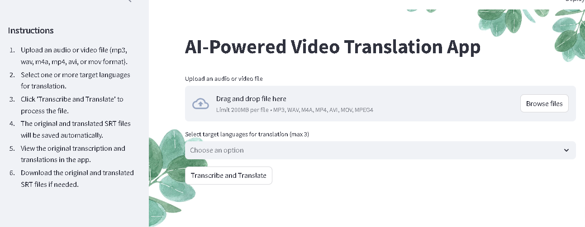

# AI-Supported Startup Application

## About
This application leverages AI to provide an intuitive way to transcribe and translate audio or video files into multiple languages. It uses OpenAI's Whisper model for transcription and GPT-4 for translation, offering a seamless experience for generating SRT subtitle files.

---
## Demo Screenshot



---

## Features
- **Audio/Video File Upload**: Upload audio or video files in formats like mp3, wav, m4a, mp4, avi, and mov.
- **Transcription**: Automatically transcribe the audio of the uploaded file using OpenAI's Whisper model.
- **Translation**: Translate the transcription into up to three target languages at once.
- **SRT File Generation**: Generates and allows users to download SRT files for both the original and translated texts.
- **Background Image**: Customizable background image for a visually appealing user experience.

---

## Requirements
- Python 3.7 or higher
- `streamlit` library
- `openai` library
- `ffmpeg` (for video-to-audio conversion)
- `python-dotenv` (for loading environment variables)

---

## Installation

1. Clone the repository:
    ```bash
    git clone https://github.com/csm34/UPSchoolCapstoneProject.git
    cd UPSchoolCapstoneProject
    ```

2. Install the necessary dependencies:
    ```bash
    pip install -r requirements.txt
    ```

3. Set up your `.env` file with your OpenAI API key:
    ```bash
    OPENAI_API_KEY=your_api_key
    ```

4. Ensure you have `ffmpeg` installed on your system for video-to-audio conversion. You can install it via:
    - **macOS**: `brew install ffmpeg`
    - **Windows**: Download from [FFmpeg Official Website](https://ffmpeg.org/download.html)
    - **Linux**: `sudo apt install ffmpeg`

---

## Running the Application

To run the application, use the following command:

```bash
streamlit run main.py
```
This will open the application in your default browser.

---

## How to Use
- Upload a File: Upload an audio or video file (mp3, wav, m4a, mp4, avi, or mov format).
- Select Target Languages: Choose one or more target languages for translation (up to 3 languages).
- Transcribe and Translate: Click on "Transcribe and Translate" to process the file.
- View Transcription and Translations: View the original transcription and its translations in the app.
- Download SRT Files: Download the SRT files for both the original and translated subtitles.

---

## Technologies Used
- Streamlit: For building the interactive web app.
- OpenAI API (Whisper & GPT-4): For transcribing and translating audio.
- FFmpeg: For converting video files to audio format.
- Python: For backend logic and processing.

--- 

## Credits
This app was created with the help of ChatGPT.

## License
MIT License. See LICENSE for details.
